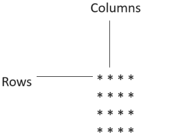

## Why are patterns are important in order to start DS-Algo ?
No matter the topic—whether it's Dynamic Programming, Graphs, Trees, Arrays, or Binary Search—**loops are a common element**. Understanding loops in depth is crucial for mastering Data Structures and Algorithms. This is why learning patterns in loops is important.

#### Generally all the patterns that we will be printing will have nested loops.
1. Outer loop —rows
2. Inner loop —columns 

#### 4 rules to solve any pattern
1) for the outer loop, count the no. of rows
2) for the inner loop, focus on the columns and connect them somehow to the rows.
3) print them inside the inner for loop.
4) observe symmetry **[optional]**
